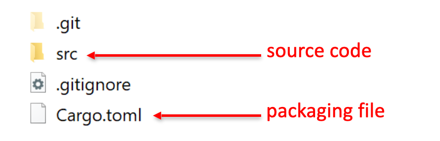

# Getting Started with Rust 

### What is Rust?

- Rust is a flexible and fast programming language
  - Combines power/speed with rigour/safety

### What can I do with Rust?
- You can use Rust to create all kinds of application
  - Low-level systems programming
  - High-level business applications
  - Toolsets (e.g. operating systems, DevOps operators, etc.)
  - Products (e.g. much of Firefox is written in Rust) 


### What tools do I need for Rust?

## Installing Rust
To install Rust on Linux or macOS: 
<br>

Run the following command in a Terminal window

- Installs rustup, which then installs latest stable version of Rust <br>
``` curl --proto '=https' --tlsv1.2 https://sh.rustup.rs -sSf | sh```

- To install Rust on Windows: <br>
See https://www.rust-lang.org/tools/install

- You'll also need the C++ build tools for VS 2013 or later

## Verifying Rust Installation

To verify Rust installation: <br>
Run the following command in a Terminal window <br>
```bash 
rustc --version
```


# Example: Hello world in Rust <br>

### Writing a simple application <br>
- Here's the traditional 'hello world' application in Rust

```bash
fn main() {
    println!("Hello, world!");
}
```

- main() is the entry-point function in a Rust executable
- println! calls a macro (for info, search for macro_rules!). <br>
- Semicolons are required to separate statements

**For detailed Rust documentation, see:** <br>
https://doc.rust-lang.org/std/index.html 


### Formatting the code <br>
You can use the rustfmt tool to format your code <br>
```bash
rustfmt hello_world.rs
```
What does it do? <br>
- Replaces tabs with 4 spaces
- Eliminates spurious whitespace
- Arranges curly brackets according to Rust best practice

### Building the application <br>
To build the app, you can use the Rust compiler as follows: <br>
```bash
rustc hello_world.rs
```
What does it do?
- Generates an executable (.exe file extension in Windows)
- In Windows, also generates a .pdb file (contains debug info)

### Running the application <br>
To run the application on Linux or macOS:
```bash
./hello_world
```

To run the application on Windows:
```bash
.\hello_world.exe
```

### Aside: Using the Rust Playground <br>
The Rust Playground is a handy online site you can use to practise your Rust syntax - go to https://play.rust-lang.org/ 


## Using Cargo
### What is Cargo?<br>

- Cargo is the Rust package manager and build system
- Part of the standard Rust toolset <br>

In practice, you'll always use Cargo to create, manage, and build your Rust applications  <br>
- Consistency
- Nudges you towards best practice

### Creating a new application using Cargo
- You can use Cargo to create a new Rust application:

```bash
cargo new hello_world_via_cargo
```
- Creates a new directory for your application, containing:


###  Reviewing the .toml file
The .toml file contains: <br>
- Metadata about your package (i.e. application) <br>
- Any additional dependencies your application needs <br>
```bash
[package]
name = "hello_world_via_cargo"
version = "0.1.0"
edition = "2021"

[dependencies]
```

*Fun fact:TOML stands for Tom's Obvious Minimal Language*

###  Reviewing the source code
Here's the source code generated by Cargo:
```bash
fn main() {
    println!("Hello, world!");
}
```
###  Building/running in dev mode
To build the application in dev mode: <br>
- Fast build (unoptimized, contains debug info) <br>
- Creates app in .\target\debug\ <br>

```
cargo build
```
To run the application (e.g. on Windows):
```
.\target\debug\hello_world_via_cargo.exe
``` 

###  Building/running in release mode
To build the application in release mode:
- Slower build (optimized, no debug info)
- Creates app in .\target\release\
```
cargo build --release
```
To run the application (e.g. on Windows):

```
.\target\release\hello_world_via_cargo.exe
```
###  Additional Cargo techniques
You can build/run in one go:
Builds the app if it's changed, then runs it
```
cargo run
```
or
```
cargo run --release
```

- If you just want a quick check to see if the code compiles:
- Faster than a "build" because it doesn't generate an executable 
```
cargo check
```
<br>
<br>

# Rust Language Essentials

  Types and variables
  Flow control, functions, and collections
  Modules and packages
  Using the Cargo dependency manager and build tool
  Example: Organizing, building, and running a Rust application
  Break (5 min)

Segment 3: Object Orientation (40 min)

  Defining structures
  Implementing functionality
  Specifying traits
  Example: Implementing OO design patterns
  Break (5 min)

Segment 4: Memory Management (40 min)

  What memory management problems does Rust solve?
  The stack, the heap, and ownership
  Referencing and borrowing
  Unsafe Rust
  Example: Memory management patterns
  Break (5 min)

Segment 5: Concurrency (40 min)

  Overview of concurrency in Rust
  Creating threads
  Defining actors and passing messages
  Accessing shared data safely
  Example: Implementing a concurrent application
  Break (5 min)

Segment 6: A Taster of Additional Rust Techniques (40 min)

  Working with embedded systems
  Performing data analysis
  Accessing a database
  Implementing a REST API
  Course wrap-up and next steps

